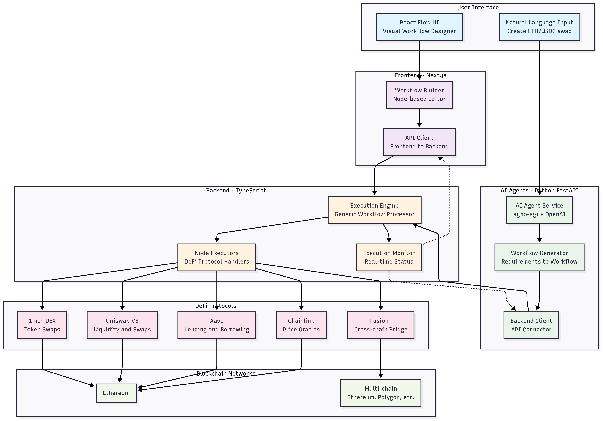

# 🚀 Koan - No-Code DeFi Platform

**Koan** is a powerful no-code platform that enables users to design complex DeFi workflows and deploy decentralized applications through an intuitive node-based visual interface. With built-in AI agents and comprehensive DeFi protocol integrations, Koan makes blockchain development accessible to everyone.

## 🌟 Key Features

- **🎨 Visual Workflow Builder**: Drag-and-drop node-based interface powered by React Flow
- **🤖 AI-Powered Generation**: Natural language input to automatically generate DeFi workflows
- **🔗 Multi-Protocol Integration**: Native support for 1inch, Uniswap, Aave, Chainlink, and more
- **⚡ Real-time Execution**: Live monitoring and execution of blockchain workflows
- **🌐 Cross-chain Support**: Bridge assets and execute operations across multiple networks
- **📱 Modern UI/UX**: Beautiful, responsive interface built with Next.js and Tailwind CSS

## 🏗️ Architecture

Koan consists of three main components working together to provide a seamless no-code DeFi experience:



### 🎯 Component Overview

#### **Frontend** (`/frontend`)
- **Technology**: Next.js 14 with React 18, TypeScript, Tailwind CSS
- **Purpose**: Interactive visual workflow designer and user interface
- **Key Features**:
  - React Flow-based node editor for visual workflow design
  - Real-time preview and testing capabilities
  - Responsive modern UI with dark/light themes
  - Component library with 80+ custom components

#### **Backend** (`/backend`) 
- **Technology**: TypeScript, Express.js, Socket.io
- **Purpose**: DeFi workflow execution engine and API services
- **Key Features**:
  - Generic execution engine supporting custom node types
  - Real-time workflow execution with progress monitoring
  - Native integrations with major DeFi protocols
  - WebSocket support for live updates

#### **AI Agents** (`/agents`)
- **Technology**: Python, FastAPI, OpenAI/Anthropic APIs
- **Purpose**: Natural language processing and intelligent workflow generation
- **Key Features**:
  - Multi-agent orchestration with agno-agi framework
  - Natural language to workflow conversion
  - Smart contract analysis and optimization
  - Automated DeFi strategy generation

## 🚀 Quick Start

### Prerequisites

- **Node.js** 18+ and npm/pnpm
- **Python** 3.12+ 
- **Git**

### 1. Clone Repository

```bash
git clone <repository-url>
cd Lowcode_defi
```

### 2. Setup Frontend

```bash
cd frontend
npm install
# Copy environment template
cp env.local.example .env.local
# Add your API keys and configuration
npm run dev
```

The frontend will be available at `http://localhost:3000`

### 3. Setup Backend

```bash
cd backend
npm install
# Copy environment template  
cp env.example .env
# Add your blockchain RPC URLs and API keys
npm run dev
```

The backend API will be available at `http://localhost:3001`

### 4. Setup AI Agents

```bash
cd agents
# Using UV (recommended)
uv venv && source .venv/bin/activate && uv sync

# Or using pip
python -m venv .venv && source .venv/bin/activate && pip install -r requirements.txt

# Add API keys to .env file
cd src && python main.py
```

The AI agents API will be available at `http://localhost:8000`

## 🔧 Project Structure

```
Koan/
├── frontend/              # Next.js React application
│   ├── app/              # App router pages and API routes
│   ├── components/       # 80+ reusable UI components
│   ├── lib/              # Utilities, clients, and integrations
│   └── public/           # Static assets
├── backend/              # TypeScript execution engine
│   ├── src/
│   │   ├── engine/       # Generic workflow execution engine
│   │   ├── nodes/        # DeFi protocol node implementations
│   │   ├── routes/       # Express.js API endpoints
│   │   └── services/     # Core business logic services
│   └── dist/             # Compiled JavaScript output
├── agents/               # Python AI agent system
│   ├── src/
│   │   ├── agents/       # AI agent implementations
│   │   ├── api/          # Backend integration client
│   │   └── workflow/     # Workflow generation logic
│   └── requirements.txt  # Python dependencies
├── contracts/            # Smart contract examples and templates
├── scripts/              # Development and testing scripts
└── README.md            # This file
```

## 🔌 Supported DeFi Protocols

- **1inch**: DEX aggregation and optimal swap routing
- **Uniswap V3**: Concentrated liquidity and swaps
- **Aave**: Lending and borrowing protocols
- **Chainlink**: Decentralized price oracles
- **Fusion+**: Cross-chain bridge and asset transfers
- **Gnosis Safe**: Multi-signature wallet operations
- **Maker**: CDP creation and DAI generation

## 🎯 Use Cases

### DeFi Applications
- **DEX Aggregators**: Multi-protocol swap routing
- **Yield Farming**: Automated liquidity provision strategies
- **Portfolio Management**: Multi-asset rebalancing and monitoring
- **Arbitrage Bots**: Cross-exchange profit opportunities

### DAO Tools
- **Governance Platforms**: Proposal creation and voting systems
- **Treasury Management**: Multi-sig operations and fund allocation
- **Community Tools**: Token distribution and reward systems

### Cross-chain Operations
- **Bridge Applications**: Asset transfers between networks
- **Multi-chain Strategies**: Coordinated operations across blockchains
- **Liquidity Optimization**: Capital efficiency across protocols

## 🧠 AI-Powered Workflow Generation

Koan's AI agents can understand natural language requests and automatically generate complete DeFi workflows:

**Example Inputs:**
- *"Create a swap application for ETH, USDC, and WBTC with slippage protection"*
- *"Build a yield farming strategy for Uniswap V3 with automated rebalancing"*
- *"Set up a cross-chain bridge for moving assets between Ethereum and Polygon"*

The AI system analyzes these requests and produces executable workflows with:
- Appropriate node selections and configurations
- Proper error handling and validation
- Optimized execution paths
- Security best practices

## 📊 Monitoring & Analytics

- **Real-time Execution**: Live progress tracking for all workflow steps
- **Performance Metrics**: Gas usage, execution time, and success rates
- **Error Handling**: Comprehensive logging and debugging information
- **Historical Data**: Execution history and analytics dashboard

## 🛡️ Security Features

- **Input Validation**: Comprehensive parameter checking and sanitization
- **Access Controls**: Role-based permissions and authentication
- **Audit Logging**: Complete execution history and audit trails
- **Safe Execution**: Sandboxed environment for workflow testing

## 🤝 Contributing

We welcome contributions! Please see our [Contributing Guidelines](CONTRIBUTING.md) for details on:

- Code style and standards
- Testing requirements
- Pull request process
- Issue reporting

## 📄 License

This project is licensed under the MIT License - see the [LICENSE](LICENSE) file for details.

## 🆘 Support

- **Documentation**: [Full documentation](docs/)
- **Issues**: [GitHub Issues](issues/)
- **Discussions**: [GitHub Discussions](discussions/)

---

**Built with ❤️ for the DeFi community**